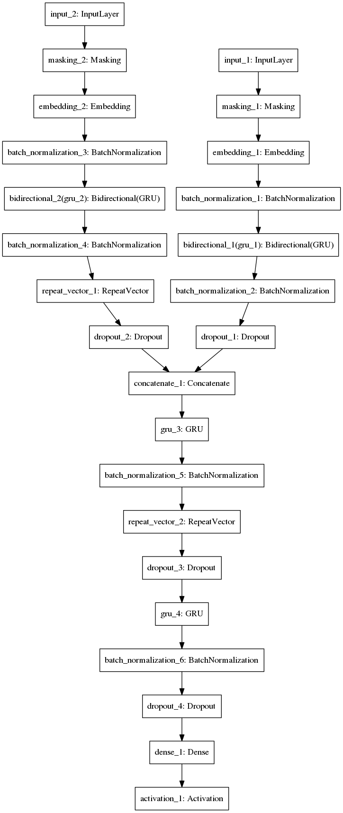

# Ask me

### 1. Введение

  В настоящее время методы глубинного обучения являются очень активно развивающейся отраслью компьютерных наук, так как появились достаточные для быстрого выполнения операций, используемых в нейронных сетях, вычислительные мощности, а спустя некоторое время после этого — и библиотеки для популярных языков программирования, позволяющие сочетать высокую скорость прототипирования и достаточно производительный результат при необходимости использования полученной модели в различных сервисах. Одной из сфер, в которых Deep Learning опережает все остальные известные на данный момент алгоритмы машинного обучения, является обработка естественного языка, причём как в устной, так и в письменной форме речи. Хотя на текущем уровне технологического развития нейронные сети ещё довольно далеки от ведения полноценного диалога на свободную тематику, их способности корректно работать с отдельными «компонентами» разговора активно исследуются научными группами по всему миру. В числе задач, для которых была получена высокая точность (пусть и на ограниченном лексиконе), находится ответ на вопросу, основанный на некотором контексте. Разработке модели, справляющейся с данной задачей не хуже, а возможно, и лучше описанной в [статье](https://arxiv.org/pdf/1506.07285.pdf), и был посвящён данный проект.
  
  В процессе работы над проектом было решено несколько подготовительных задач (папка ```labs```), охватывающих различные области глубинного обучения от выбора алгоритма градиентного спуска до работы с векторными представлениями слов, обучена нейронная сеть, способная отвечать на заданные на естественном языке вопросы с предшествующей информацией, а также создан веб-интерфейс, позволяющий в удобном виде работать с уже обученной сетью (папка ```main```).

### 2. Предыдущие работы на данную тематику

Посвящённых решению задачи ответов на вопросы на естественном языке нейронных сетей на момент начала работы над проектом существовало уже достаточно большое количество. Также статьи появлялись и в процессе работы, поэтому имеет смысл упомянуть и их, так как зачастую высказанные авторами идеи позволили им добиться весомого прироста в точности. 
* [Memory Networks](https://arxiv.org/pdf/1410.3916.pdf)
* [End-To-End Memory Networks](https://arxiv.org/abs/1503.08895)
* [Question Answering from Unstructured Text by Retrieval and Comprehension](https://arxiv.org/pdf/1703.08885.pdf)
* [Temporal Information Extraction for Question Answering Using Syntactic Dependencies in an LSTM-based Architecture](https://arxiv.org/abs/1703.05851)
* [Exploring Question Understanding and Adaptation in Neural-Network-Based Question Answering](https://arxiv.org/abs/1703.04617)
* [Making Neural QA as Simple as Possible but not Simpler](https://arxiv.org/abs/1703.04816)
* [Dynamic Memory Networks for Visual and Textual Question Answering](https://arxiv.org/abs/1603.01417)
* [Ask Me Even More: Dynamic Memory Tensor Networks (Extended Model)](https://arxiv.org/abs/1703.03939)

### 3. Архитектура



Были проведены эксперименты на архитектуре, описанной в статье, однако на всех задачах датасета модель давала не очень высокое качество (в терминах точности ответа), поэтому была создана сеть немного отличающейся структуры: входной контекст и вопрос переводятся в векторное представление (инициализированное GloVe), затем обрабатываются с помощью рекуррентных нейронных сетей (GRU). Полученные векторы конкатенируются и подаются на вход ещё одной нейронной сети, затем её выход копируется 3 раза (чтобы ограничить размер выходного предложения 3 словами), и после ещё одного рекуррентного слоя, проходя через слой Softmax, относятся к одному из классов — слов в словаре. Оптимизируются веса с помощью Adam, также между рекуррентными слоями находятся Dropout и BatchNormalization-слои. Размерность векторных представлений слов, а также всех слоёв, кроме выходного — 100.

### 4. Достигнутые результаты

На обучающей выборке достигнута точность 99%, на валидационной — 96,5. На значительную часть вопросов при ручной оценке сеть отвечает корректно, однако при смешивании типов задач доля правильных ответов падает.

### 5. Заключение

Данная архитектура, как можно заметить из показателей метрик, не уступает указанной в исходной статье. Сеть можно усовершенствовать с помощью как добавления дополнительных рекуррентных слоёв, увеличения размерности внутренних представлений, генерации большего числа тренировочных данных и большего числа эпох. Так как в данной архитектуре не применяется внимание, можно с использованием указанных выше статей либо создать «ансамбль», в котором предсказание правильного ответа будет выполняться по принципу большинства, либо синтезировать идеи и разработать единую нейронную сеть, задействующую различные механизмы для получения ответа на вопрос.

### 6. Инструкции по запуску

Установка и запуск всех исполняемых файлов проекта тестировалась на Ubuntu 16.10.
Для запуска необходимы установленные Python 3 с virtualenv и CUDA, все остальные библиотеки будут установлены в процессе.

```
git clone https://github.com/mryab/askme.git
cd askme
virtualenv env
source env/bin/activate
pip install -r requirements.txt
cd main
./download_data.sh
python3 server.py
```
После запуска по адресу 127.0.0.1:6006 будет доступен интерфейс для работы с сетью (указания контекста и задания вопроса).

Также возможно запустить саму сеть для валидации (```run.py```) и обучения заново (```run.py --train```).
